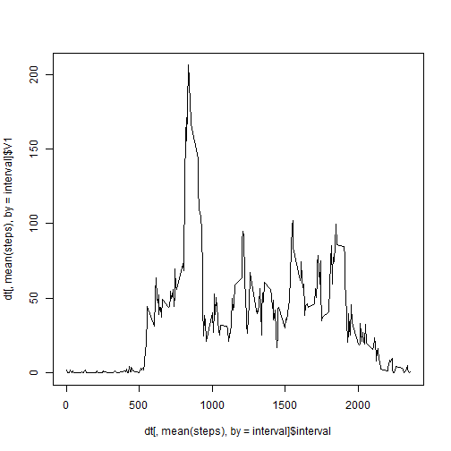
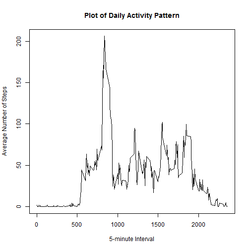
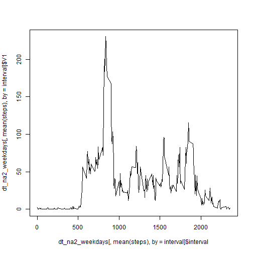
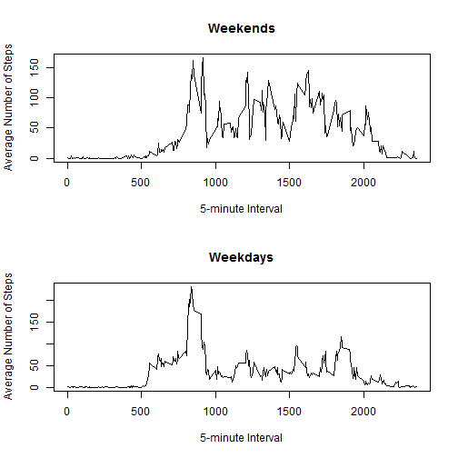

Peer Assessment 1
========================

This assignment makes use of data from a personal activity monitoring device. This device collects data at 5 minute intervals through out the day. The data consists of two months of data from an anonymous individual collected during the months of October and November, 2012 and include the number of steps taken in 5 minute intervals each day.


### Loading and preprocessing the data


* First read in the Activity.csv data file.


```r
mydata = read.csv("activity.csv") 
```
* The data set includes 17,568 records and three variables.
* The Steps and Interval variables will be numeric.
* The Date field will be treated as a data value YYYY-MM-DD format.


* Next create the data frame with NA rows.


```r
df_na <- data.frame(mydata)
df_na$date <- as.Date(df_na$date)
summary(df_na)
```

```
##      steps            date               interval   
##  Min.   :  0.0   Min.   :2012-10-01   Min.   :   0  
##  1st Qu.:  0.0   1st Qu.:2012-10-16   1st Qu.: 589  
##  Median :  0.0   Median :2012-10-31   Median :1178  
##  Mean   : 37.4   Mean   :2012-10-31   Mean   :1178  
##  3rd Qu.: 12.0   3rd Qu.:2012-11-15   3rd Qu.:1766  
##  Max.   :806.0   Max.   :2012-11-30   Max.   :2355  
##  NA's   :2304
```


* Create the data frame without NA rows.


```r
df <- data.frame(df_na[complete.cases(df_na), ])
str(df)
```

```
## 'data.frame':	15264 obs. of  3 variables:
##  $ steps   : int  0 0 0 0 0 0 0 0 0 0 ...
##  $ date    : Date, format: "2012-10-02" "2012-10-02" ...
##  $ interval: int  0 5 10 15 20 25 30 35 40 45 ...
```


* Create the data table without NA rows.


```r
library(data.table)
```

```
## data.table 1.9.2  For help type: help("data.table")
```

```r
dt <- data.table(df)
str(dt)
```

```
## Classes 'data.table' and 'data.frame':	15264 obs. of  3 variables:
##  $ steps   : int  0 0 0 0 0 0 0 0 0 0 ...
##  $ date    : Date, format: "2012-10-02" "2012-10-02" ...
##  $ interval: int  0 5 10 15 20 25 30 35 40 45 ...
##  - attr(*, ".internal.selfref")=<externalptr>
```


### What is mean total number of steps taken per day?


* Make a histogram of the total number of steps taken each day.
* Calculate and report the mean and median total number of steps taken per day.


```r
# total number of steps taken per day
dt_steps <- dt[,sum(steps),by = date]

# mean total number of steps taken per day
mean(dt_steps$V1)
```

```
## [1] 10766
```

```r
# median total number of steps taken per day
median(dt_steps$V1)
```

```
## [1] 10765
```
* The mean and median total daily steps taken are 10766 and 10765 respectively.


```r
hist(dt_steps$V1, breaks = 53, main="Histogram - Total Step per Day",  xlab = "Steps")
```

 


### What is the average daily activity pattern?


* Make a time series plot of the 5-minute interval (x-axis) and the average number of steps taken,
* averaged across all days (y-axis)


```r
plot( dt[,mean(steps),by = interval]$interval,dt[,mean(steps),by = interval]$V1,type = "l", main="Plot of Daily Activity Pattern",  xlab = "5-minute Interval", ylab = "Average Number of Steps")
```

 

```r
# maximum number of steps
max(dt[,mean(steps), by = interval]$V1)
```

```
## [1] 206.2
```

```r
# index of maximum number of steps
index.max <- which.max(dt[,mean(steps), by = interval]$V1)

# interval of maximum number of steps
dt[index.max]$interval
```

```
## [1] 835
```
* The Daily Activity Pattern has peak of 206.2 Steps at an Interval of 835.


```r
str(df_na)
```

```
## 'data.frame':	17568 obs. of  3 variables:
##  $ steps   : int  NA NA NA NA NA NA NA NA NA NA ...
##  $ date    : Date, format: "2012-10-01" "2012-10-01" ...
##  $ interval: int  0 5 10 15 20 25 30 35 40 45 ...
```

```r
str(df)
```

```
## 'data.frame':	15264 obs. of  3 variables:
##  $ steps   : int  0 0 0 0 0 0 0 0 0 0 ...
##  $ date    : Date, format: "2012-10-02" "2012-10-02" ...
##  $ interval: int  0 5 10 15 20 25 30 35 40 45 ...
```
* The original data frame with NA values has 17560 objects while the cleaned 
* data frame has 15264. The works out to be 2296 NA records.


### Inputing missing values


* Calculate and report the total number of missing values in the dataset.


```r
# use the mean step value for the interval
dt_mean_interval <- dt[,mean(steps),by = interval]
df_filled <- df_na
df_filled[is.na(df_filled$steps) , ]$steps <- dt_mean_interval$V1

# calculate and report the mean and median total number of steps taken per day.
summary(df_filled)
```

```
##      steps            date               interval   
##  Min.   :  0.0   Min.   :2012-10-01   Min.   :   0  
##  1st Qu.:  0.0   1st Qu.:2012-10-16   1st Qu.: 589  
##  Median :  0.0   Median :2012-10-31   Median :1178  
##  Mean   : 37.4   Mean   :2012-10-31   Mean   :1178  
##  3rd Qu.: 27.0   3rd Qu.:2012-11-15   3rd Qu.:1766  
##  Max.   :806.0   Max.   :2012-11-30   Max.   :2355
```
* The NA values are replaced with the mean number of steps of the interval.


* Make a histogram of the total number of steps taken each day.


```r
dt_filled <- data.table(df_filled)
dt_filled_steps <- dt_filled[,sum(steps),by = date]
hist(dt_filled_steps$V1, breaks = 61, main="Histogram with NA Values- Total Steps per Day", xlab = "Steps")
```

 


### Are there differences in activity patterns between weekdays and weekends?


* Create a new factor variable in the dataset with two levels – “weekday” and “weekend”
* indicating whether a given date is a weekday or weekend day.


```r
# averaged across all weekend days
dt_na2_weekends <- data.table(dt_filled[weekdays(as.Date(dt_filled$date)) %in%  c("Sunday","Saturday")])

# averaged across all weekday days
dt_na2_weekdays <- data.table(dt_filled[weekdays(as.Date(dt_filled$date)) %in%  c("Monday","Tuesday","Wednesday","Thursday","Friday")])
```


* Make a panel plot containing a time series plot (i.e. type = "l") of the 5-minute interval (x-axis) and
* the average number of steps taken, averaged across all weekday days or weekend days (y-axis). 


```r
par( mfrow = c( 2,1 ) )

# plot averaged across all weekend days
plot( dt_na2_weekends[,mean(steps),by = interval]$interval,dt_na2_weekends[,mean(steps),by = interval]$V1,type = "l", main="Weekends",  xlab = "5-minute Interval", ylab = "Average Number of Steps")

# plot averaged across all weekday days 
plot( dt_na2_weekdays[,mean(steps),by = interval]$interval,dt_na2_weekdays[,mean(steps),by = interval]$V1,type = "l", main="Weekdays",  xlab = "5-minute Interval", ylab = "Average Number of Steps")
```

 

* The Weekdays Pattern is marked a large peak around Interval 800 followed by flatter readings for the rest of the Interval range.
* The Weekend Pattern also has an peak around Interval 800 but the Steps remain much higher through the rest of the Interval range.


