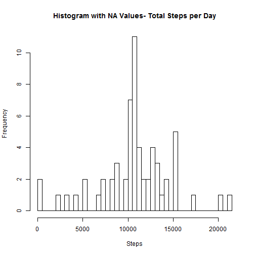

Peer Assessment 1
========================

This assignment makes use of data from a personal activity monitoring device. This device collects data at 5 minute intervals through out the day. The data consists of two months of data from an anonymous individual collected during the months of October and November, 2012 and include the number of steps taken in 5 minute intervals each day.


## Loading and preprocessing the data


* read csv


```r
mydata = read.csv("activity.csv") 
```

* create data frame with na


```r
df_na <- data.frame(mydata)
df_na$date <- as.Date(df_na$date)
summary(df_na)
```

```
##      steps            date               interval   
##  Min.   :  0.0   Min.   :2012-10-01   Min.   :   0  
##  1st Qu.:  0.0   1st Qu.:2012-10-16   1st Qu.: 589  
##  Median :  0.0   Median :2012-10-31   Median :1178  
##  Mean   : 37.4   Mean   :2012-10-31   Mean   :1178  
##  3rd Qu.: 12.0   3rd Qu.:2012-11-15   3rd Qu.:1766  
##  Max.   :806.0   Max.   :2012-11-30   Max.   :2355  
##  NA's   :2304
```

* create data frame without na


```r
df <- data.frame(df_na[complete.cases(df_na), ])
summary(df)
```

```
##      steps            date               interval   
##  Min.   :  0.0   Min.   :2012-10-02   Min.   :   0  
##  1st Qu.:  0.0   1st Qu.:2012-10-16   1st Qu.: 589  
##  Median :  0.0   Median :2012-10-29   Median :1178  
##  Mean   : 37.4   Mean   :2012-10-30   Mean   :1178  
##  3rd Qu.: 12.0   3rd Qu.:2012-11-16   3rd Qu.:1766  
##  Max.   :806.0   Max.   :2012-11-29   Max.   :2355
```

* create data table


```r
library(data.table)
dt <- data.table(df)
```


* calculate total number steps per day, mean, median


```r
dt_steps <- dt[,sum(steps),by = date]
mean(dt_steps$V1)
```

```
## [1] 10766
```

```r
median(dt_steps$V1)
```

```
## [1] 10765
```

```r
hist(dt_steps$V1, breaks = 53, main="Histogram - Total Step per Day")
```

 


## What is the average daily activity pattern?


* plot of mean steps against intervals


```r
plot( dt[,mean(steps),by = interval]$interval,dt[,mean(steps),by = interval]$V1,type = "l")
```

 

```r
max(dt[,mean(steps),by = interval]$V1)
```

```
## [1] 206.2
```


* find length of data frames


```r
str(df_na)
```

```
## 'data.frame':	17568 obs. of  3 variables:
##  $ steps   : int  NA NA NA NA NA NA NA NA NA NA ...
##  $ date    : Date, format: "2012-10-01" "2012-10-01" ...
##  $ interval: int  0 5 10 15 20 25 30 35 40 45 ...
```

```r
str(df)
```

```
## 'data.frame':	15264 obs. of  3 variables:
##  $ steps   : int  0 0 0 0 0 0 0 0 0 0 ...
##  $ date    : Date, format: "2012-10-02" "2012-10-02" ...
##  $ interval: int  0 5 10 15 20 25 30 35 40 45 ...
```


## Imputing missing values


* calculate mean values per interval to replace na


```r
dt_mean_interval <- dt[,mean(steps),by = interval]
df_filled <- df_na
df_filled[is.na(df_filled$steps) , ]$steps <- dt_mean_interval$V1
str(df_filled)
```

```
## 'data.frame':	17568 obs. of  3 variables:
##  $ steps   : num  1.717 0.3396 0.1321 0.1509 0.0755 ...
##  $ date    : Date, format: "2012-10-01" "2012-10-01" ...
##  $ interval: int  0 5 10 15 20 25 30 35 40 45 ...
```

* histogram for na data filled, total steps per day


```r
dt_filled <- data.table(df_filled)
dt_filled_steps <- dt_filled[,sum(steps),by = date]
hist(dt_filled_steps$V1, breaks = 61, main="Histogram (na filled)- Total Step per Day")
```

 


## Are there differences in activity patterns between weekdays and weekends?


* weekdays


```r
dt_na2_weekdays <- data.table(dt_filled[weekdays(as.Date(dt_filled$date)) %in%  c("Monday","Tuesday","Wednesday","Thursday","Friday")])
plot( dt_na2_weekdays[,mean(steps),by = interval]$interval,dt_na2_weekdays[,mean(steps),by = interval]$V1,type = "l")
```

 


* weekends


```r
dt_na2_weekends <- data.table(dt_filled[weekdays(as.Date(dt_filled$date)) %in%  c("Sunday","Saturday")])
plot( dt_na2_weekends[,mean(steps),by = interval]$interval,dt_na2_weekends[,mean(steps),by = interval]$V1,type = "l")
```

 
